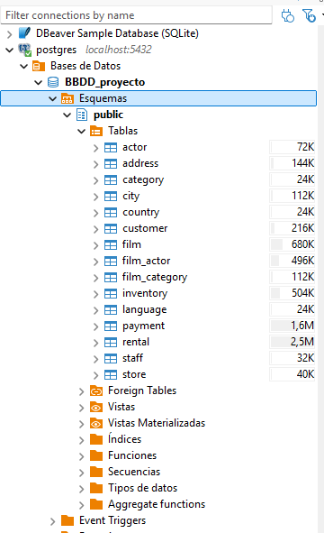
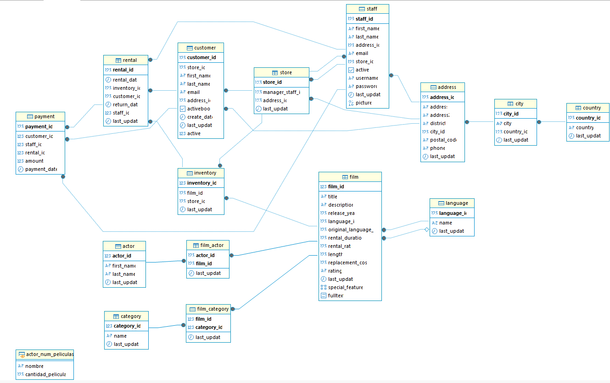

# Proyecto BBDD SQL

## **Explicación del proyecto** ##

Trabajamos con una base de datos de una tienda ficticia de películas. Para ello, vamos a utilizar las siguientes herramientas:
**- PostgreSQL**
**- Dbeaver**

**Paso 1**
En primer lugar, descargamos la base de datos y los enunciados de las consultas para poder hacer el proyecto.

**Paso 2**
En segundo lugar, una vez descargada la base de datos, vamos al programa Dbeaver e importamos la nueva base de datos. En este caso, la ha llamado "BBDD_proyecto"

**Paso 3**
En tercer lugar, con la base de datos instalada, generamos las tablas (imagen 1) y el esquema (imagen 2) para ver la relación entre todas las tablas.

## **Esquema de la base de datos** ##
A continuación vemos con detalle tanto todas las tablas que hay (imagen1_tablas) en la base de datos como la relación que hay entre ella (imagen2_esquema)

